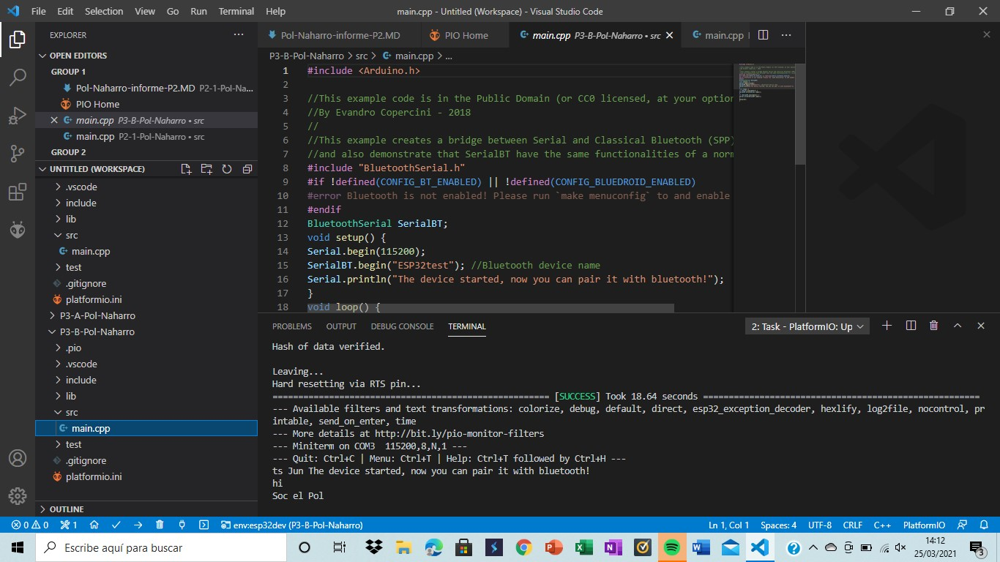
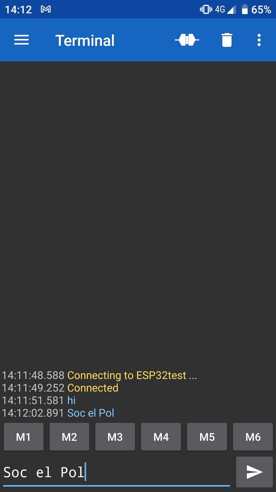

Pol Naharro
## PRACTICA 3 : WIFI y BLUETOOTH PARTE B

##### Código Practica B: 

```
#include <Arduino.h>

//This example code is in the Public Domain (or CC0 licensed, at your option.)
//By Evandro Copercini - 2018
//
//This example creates a bridge between Serial and Classical Bluetooth (SPP)
//and also demonstrate that SerialBT have the same functionalities of a normal Serial
#include "BluetoothSerial.h"
#if !defined(CONFIG_BT_ENABLED) || !defined(CONFIG_BLUEDROID_ENABLED)
#error Bluetooth is not enabled! Please run `make menuconfig` to and enable it
#endif
BluetoothSerial SerialBT;
void setup() {
Serial.begin(115200);
SerialBT.begin("ESP32test"); //Bluetooth device name
Serial.println("The device started, now you can pair it with bluetooth!");
}
void loop() {
if (Serial.available()) {
SerialBT.write(Serial.read());
}
if (SerialBT.available()) {
Serial.write(SerialBT.read());
}
delay(20);
}
```
##### Explicación:

###### Practica B: 

Primero declaramos la conexión bluetooth con la instrucción BluetoothSerial SerialBT;.

A continuación hacemos el setup comenzando Serial.begin(115200); para ver los datos en el monitor. Seguidamente inicializamos el bluetooth con el nombre "ESP32test" y sacamos la confirmación de su funcionamiento por pantalla. (instrucciones: SerialBT.begin("ESP32test"); y Serial.println("The device started, now you can pair it with bluetooth!"); )

Por último el loop nos muestra por pantalla la información que se introduzca con el dispositivo que hemos enlazado por bluetooth por medio de la aplicación Serial Bluetooth Terminal. Todo esto es posible gracias a las instrucciones siguientes:
```
void loop() {
if (Serial.available()) {
SerialBT.write(Serial.read());
}
if (SerialBT.available()) {
Serial.write(SerialBT.read());
}
delay(20);
}
```

Como resumen podemos decir que esta práctica genera una conexión bluetooth con un dispositivo y saca por pantalla lo introducido por el dispositivo en el monitor.

##### Funcionamiento de la práctica:

###### Practica B
Comprobación en ordenador:



Comprobación en teléfono:


